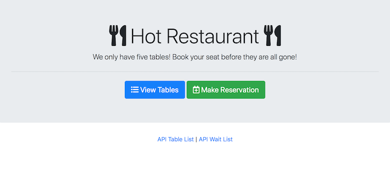
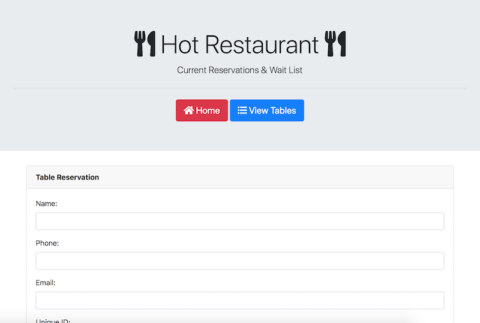
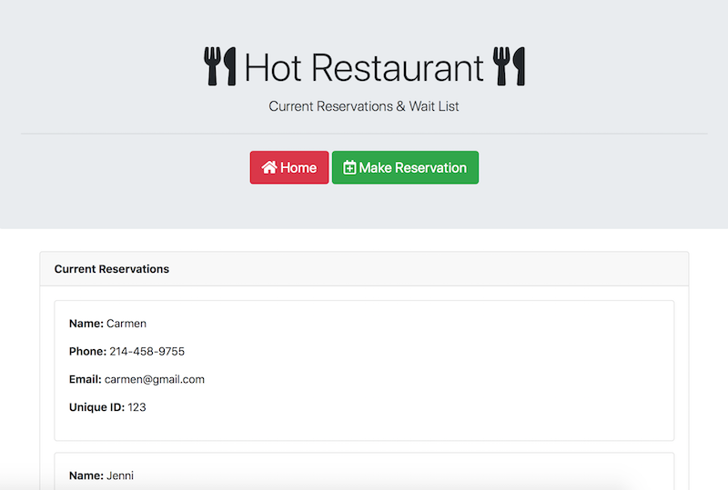

# Restaurant App

### About The Project
Hot Restaurant is a Node / Express based web application for handling reservation requests.

The front end includes HTML/CSS pages so that users can enter and view restaurant reservation data.

The back end uses Express to store, update, and relay reservation data to the app.

### To See The Project
Run the following in the console:
```
node server.js
```
Then type the following in your browser:
```
localhost:3000
```



